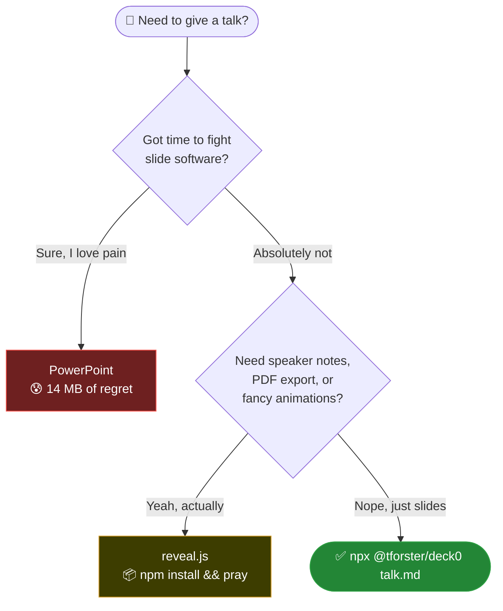

<!-- markdownlint-disable-file MD033 -->
# Present Markdown. Ship Nothing Else

You wrote your slides in an `.md` file.  
You have one dependency.  
You typed `deck0 presentation.md`.  
You are already presenting.

*That's it. That's the whole thing.*

## Why does this exist?

Because life is too short to right-click → Insert New Slide.

<!-- Markdown supports HTML, so we can do this if we really need to: -->
<p style="font-family:'JetBrains Mono','Fira Code','Roboto Mono','Source Code Pro',monospace;font-weight:500;letter-spacing:0.05em;font-size:2.5rem;color:#00a0ff;line-height:1;margin:0 0 1.5rem 0;white-space:nowrap">DECK</p>

## The PowerPoint Tax

Every PowerPoint presentation costs you something:

- 🧠 **Cognitive overhead** — Did I align that text box? Is this font consistent? Why is there a random shadow?
- ⏳ **Time** — 40 minutes of content. 3 hours of formatting.
- 💾 **File size** — A 5-slide deck somehow weighs 14 MB.
- 🔒 **Lock-in** — `.pptx` is readable by… PowerPoint. And sometimes LibreOffice. And sometimes neither.
- 😰 **The animation panel** — You opened it once. You closed it. You opened it again. You regret everything.

> [!WARNING]
> PowerPoint's "Presenter View" has a 12% chance of catastrophically failing the moment you plug in a projector.

The alternative? **A text file.**

## reveal.js — We Respect the Hustle, But…

reveal.js is genuinely impressive. It's also a framework.

- Requires a Node project scaffold
- `npm install` pulls in **hundreds** of packages
- Customising styles means fighting with its existing CSS
- Built-in themes look like 2014 conference slides
- Still need to write HTML if you want full control
- `data-markdown` is a workaround inside a workaround

```html
<!-- This is how you write a slide in reveal.js -->
<section data-markdown>
  <textarea data-template>
    ## My Slide
    Content goes here
  </textarea>
</section>
```

> [!NOTE]
> If you need speaker notes, multiplexer support, and a PDF export pipeline — use reveal.js. No shame. DECK0 is for humans who just want to *present*.

## Tables

GFM tables — pipe syntax, column alignment, rendered live:

| Language   | Paradigm         | `deck0` syntax highlight | First appeared |
| :--------- | :--------------- | :----------------------: | -------------: |
| JavaScript | Multi-paradigm   |            ✅             |           1995 |
| Rust       | Systems          |            ✅             |           2010 |
| Python     | Multi-paradigm   |            ✅             |           1991 |
| Go         | Concurrent / CSP |            ✅             |           2009 |
| SQL        | Declarative      |            ✅             |           1974 |

## Code Syntax Highlighting

Fenced code blocks via **highlight.js** — 190+ languages, GitHub dark theme:

```javascript
// deck0.js — serve a markdown file as a slide deck
import { createServer } from "http";
import { marked } from "marked";

const slides = marked.parse(src).split(/(?=<h2[\s>])/i);

createServer((req, res) => {
  res.writeHead(200, { "Content-Type": "text/html; charset=utf-8" });
  res.end(buildHtml(slides));
}).listen(33000);
```

## Callouts

GFM blockquote alerts — rendered as styled callout panels:

> [!NOTE]
> Rendered from a standard `> [!NOTE]` blockquote — no custom syntax.

> [!TIP]
> Works in GitHub README files too, so your slides and docs share the same idiom.

> [!WARNING]
> Do not open the PowerPoint animation panel. There is no coming back.

> [!IMPORTANT]
> Your content is a plain `.md` file. It lives in your repo. It diffs. It PRs. It ships.

## Images

Standard Markdown image syntax — local files served by deck0, remote URLs loaded directly by the browser:


```markdown


```

## Mermaid Diagrams



## Feature Face-Off

| Feature                     | PowerPoint | reveal.js | **DECK0** |
| --------------------------- | :--------: | :-------: | :-------: |
| Write in plain text         |     ❌      |     ✅     |     ✅     |
| Use local and remote images |     ❌      |     ✅     |     ✅     |
| One dependency              |     ❌      |     ❌     |     ✅     |
| Zero config                 |     ❌      |     ❌     |     ✅     |
| Works offline               |     ✅      |     ✅     |     ✅     |
| Version-controllable        |     😬      |     ✅     |     ✅     |
| `npx` it and go             |     ❌      |     ❌     |     ✅     |
| GFM tables                  |     ❌      |     ✅     |     ✅     |
| Callouts                    |     ❌      |     ❌     |     ✅     |
| Syntax highlighting         |     ❌      |     ✅     |     ✅     |
| Mermaid diagrams            |     ❌      |     ✅     |     ✅     |
| Inline HTML + styles        |     ❌      |     ✅     |     ✅     |
| Open format                 |     ❌      |     ✅     |     ✅     |
| File size overhead          |   14 MB    |  ~6.5 MB  |  ~17 KB   |

> [!TIP]
> DECK0 scores the win column in every row that matters for a quick technical presentation.

Includes Mermaid runtime for offline diagram support

## You're Already Done

Here's your entire workflow:

```markdown
# My Presentation

## Slide One
Your content here.

## Slide Two
More content.

## Slide Three
Done.
```

Run it:

```bash
npx @tforster/deck0 my-talk.md
```

Powered by three open source leaders in their respective fields —
[marked](https://github.com/markedjs/marked) for Markdown parsing,
[highlight.js](https://github.com/highlightjs/highlight.js) for syntax highlighting, and
[mermaid](https://github.com/mermaid-js/mermaid) for diagrams —
delivered via a Node HTTP server with pure CSS transitions.  
No build step. No config file. No `.gitignore` full of shame.

> [!IMPORTANT]
> DECK0 is a **tool**, not a framework. It gets out of your way so you can focus on what you're actually saying.

**Navigate:** `←` `→` or `Space` / `Backspace` or **click** / **right-click**  
**Quit:** `Esc`

*Now go give that talk.*
